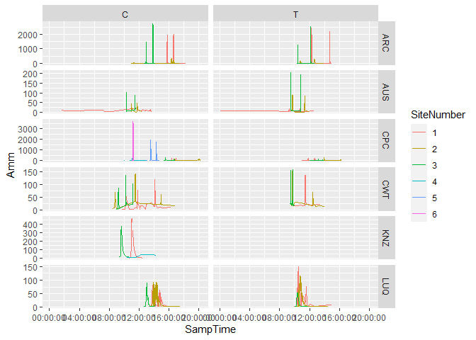

Reach Scale Inputs
================

# Inputs

## Load packages

``` r
suppressMessages(library(tidyverse))
library(readxl)
library(lubridate)
```

    ## 
    ## Attaching package: 'lubridate'

    ## The following objects are masked from 'package:base':
    ## 
    ##     date, intersect, setdiff, union

## Read in

``` r
r0 <- read_csv("./origData/Reach1.csv",
               na = c("", "-9999.0"))
```

    ## New names:
    ## Rows: 1903 Columns: 15
    ## ── Column specification
    ## ──────────────────────────────────────────────────────── Delimiter: "," chr
    ## (8): InsertTime, FileName, TableName, Biome, SiteType, ReachType, Date,... dbl
    ## (5): SiteNumber, Sample number, Ammonium (ug N/L), Chloride tracer (mg/... lgl
    ## (1): ...15 time (1): Sampling Time (hh:mm)
    ## ℹ Use `spec()` to retrieve the full column specification for this data. ℹ
    ## Specify the column types or set `show_col_types = FALSE` to quiet this message.
    ## • `` -> `...15`

``` r
problems()
```

Really only need to parse out the date from the `Date` field.

``` r
r0
```

    ## # A tibble: 1,903 × 15
    ##    InsertTime       FileName TableName Biome SiteType SiteNumber ReachType Date 
    ##    <chr>            <chr>    <chr>     <chr> <chr>         <dbl> <chr>     <chr>
    ##  1 8/29/2014 1:30:… KNZ1408… Nutu12    KNZ   E                 1 C         5/31…
    ##  2 8/29/2014 1:30:… KNZ1408… Nutu12    KNZ   E                 1 C         5/31…
    ##  3 8/29/2014 1:30:… KNZ1408… Nutu12    KNZ   E                 1 C         5/31…
    ##  4 8/29/2014 1:30:… KNZ1408… Nutu12    KNZ   E                 1 C         5/31…
    ##  5 8/29/2014 1:30:… KNZ1408… Nutu12    KNZ   E                 1 C         5/31…
    ##  6 8/29/2014 1:30:… KNZ1408… Nutu12    KNZ   E                 1 C         5/31…
    ##  7 8/29/2014 1:30:… KNZ1408… Nutu12    KNZ   E                 1 C         5/31…
    ##  8 8/29/2014 1:30:… KNZ1408… Nutu12    KNZ   E                 1 C         5/31…
    ##  9 8/29/2014 1:30:… KNZ1408… Nutu12    KNZ   E                 1 C         5/31…
    ## 10 8/29/2014 1:30:… KNZ1408… Nutu12    KNZ   E                 1 C         5/31…
    ## # … with 1,893 more rows, and 7 more variables: `Sample number` <dbl>,
    ## #   `Sampling Time (hh:mm)` <time>, `Ammonium (ug N/L)` <dbl>,
    ## #   `Chloride tracer (mg/L)` <dbl>, `Bromide tracer (mg/L)` <dbl>,
    ## #   Comments <chr>, ...15 <lgl>

``` r
r0 %>% 
  distinct(Comments)
```

    ## # A tibble: 49 × 1
    ##    Comments                  
    ##    <chr>                     
    ##  1 <NA>                      
    ##  2 4 minutes since injection 
    ##  3 6 minutes since injection 
    ##  4 35 minutes since injection
    ##  5 50 minutes since injection
    ##  6 52 minutes since injection
    ##  7 54 minutes since injection
    ##  8 56 minutes since injection
    ##  9 57 minutes since injection
    ## 10 58 minutes since injection
    ## # … with 39 more rows

Ah so we have BQL issues.

``` r
r0 %>% 
  distinct(`...15`)
```

    ## # A tibble: 1 × 1
    ##   ...15
    ##   <lgl>
    ## 1 NA

So column 15 is blank?

``` r
glimpse(r0)
```

    ## Rows: 1,903
    ## Columns: 15
    ## $ InsertTime               <chr> "8/29/2014 1:30:00 PM", "8/29/2014 1:30:00 PM…
    ## $ FileName                 <chr> "KNZ140827_ammuptake_reach.csv", "KNZ140827_a…
    ## $ TableName                <chr> "Nutu12", "Nutu12", "Nutu12", "Nutu12", "Nutu…
    ## $ Biome                    <chr> "KNZ", "KNZ", "KNZ", "KNZ", "KNZ", "KNZ", "KN…
    ## $ SiteType                 <chr> "E", "E", "E", "E", "E", "E", "E", "E", "E", …
    ## $ SiteNumber               <dbl> 1, 1, 1, 1, 1, 1, 1, 1, 1, 1, 1, 1, 1, 1, 1, …
    ## $ ReachType                <chr> "C", "C", "C", "C", "C", "C", "C", "C", "C", …
    ## $ Date                     <chr> "5/31/2014 12:00:00 AM", "5/31/2014 12:00:00 …
    ## $ `Sample number`          <dbl> 1, 2, 3, 4, 5, 6, 7, 8, 9, 10, 11, 12, 13, 14…
    ## $ `Sampling Time (hh:mm)`  <time> 10:42:00, 10:53:30, 10:54:00, 10:54:45, 10:5…
    ## $ `Ammonium (ug N/L)`      <dbl> 3.8, 6.3, 15.7, 31.3, 55.6, 95.6, 178.2, 279.…
    ## $ `Chloride tracer (mg/L)` <dbl> NA, NA, NA, NA, NA, NA, NA, NA, NA, NA, NA, N…
    ## $ `Bromide tracer (mg/L)`  <dbl> 1.1, 1.7, 4.0, 7.1, 12.7, 22.1, 33.1, 48.4, 5…
    ## $ Comments                 <chr> NA, NA, NA, NA, NA, NA, NA, NA, NA, NA, NA, N…
    ## $ ...15                    <lgl> NA, NA, NA, NA, NA, NA, NA, NA, NA, NA, NA, N…

So `Sampling Time` is OK as a time variable. Can we parse out the date
from `Date`?

How many formats?

``` r
r0 %>% 
  distinct(Date) %>% 
  print(n = 42)
```

    ## # A tibble: 42 × 1
    ##    Date                 
    ##    <chr>                
    ##  1 5/31/2014 12:00:00 AM
    ##  2 6/3/2014 12:00:00 AM 
    ##  3 5/29/2014 12:00:00 AM
    ##  4 8/26/2013 12:00:00 AM
    ##  5 7/30/2013 12:00:00 AM
    ##  6 8/21/2013 12:00:00 AM
    ##  7 7/25/2013 12:00:00 AM
    ##  8 7/28/2013 12:00:00 AM
    ##  9 8/30/2013 12:00:00 AM
    ## 10 8/2/2013 12:00:00 AM 
    ## 11 8/11/2014 12:00:00 AM
    ## 12 7/12/2013 12:00:00 AM
    ## 13 1/30/2013 12:00:00 AM
    ## 14 2/5/2013 12:00:00 AM 
    ## 15 9/7/2014 12:00:00 AM 
    ## 16 9/8/2014 12:00:00 AM 
    ## 17 9/6/2014 12:00:00 AM 
    ## 18 9/13/2014 12:00:00 AM
    ## 19 8/7/2014 12:00:00 AM 
    ## 20 7/30/2014 12:00:00 AM
    ## 21 7/15/2013 12:00:00 AM
    ## 22 8/12/2013 12:00:00 AM
    ## 23 7/7/2013 12:00:00 AM 
    ## 24 8/6/2013 12:00:00 AM 
    ## 25 7/5/2013 12:00:00 AM 
    ## 26 8/4/2013 12:00:00 AM 
    ## 27 2/3/2013 12:00:00 AM 
    ## 28 3/6/2013 12:00:00 AM 
    ## 29 3/7/2013 12:00:00 AM 
    ## 30 3/20/2013 12:00:00 AM
    ## 31 4/18/2013 12:00:00 AM
    ## 32 7/18/2013 12:00:00 AM
    ## 33 8/7/2013 12:00:00 AM 
    ## 34 8/9/2013 12:00:00 AM 
    ## 35 3/23/2013 12:00:00 AM
    ## 36 4/21/2013 12:00:00 AM
    ## 37 3/17/2013 12:00:00 AM
    ## 38 4/16/2013 12:00:00 AM
    ## 39 7/9/2014 12:00:00 AM 
    ## 40 7/21/2014 12:00:00 AM
    ## 41 7/29/2014 12:00:00 AM
    ## 42 7/17/2014 12:00:00 AM

These all appear to be dmy hms, but better check AUS dates

``` r
r0 %>% 
  filter(Biome == "AUS") %>% 
  distinct(Date)
```

    ## # A tibble: 7 × 1
    ##   Date                 
    ##   <chr>                
    ## 1 8/26/2013 12:00:00 AM
    ## 2 7/30/2013 12:00:00 AM
    ## 3 8/21/2013 12:00:00 AM
    ## 4 7/25/2013 12:00:00 AM
    ## 5 7/28/2013 12:00:00 AM
    ## 6 8/30/2013 12:00:00 AM
    ## 7 8/2/2013 12:00:00 AM

That looks OK. if we push this through Excel we get many problems with
multiple data formats in one column. Even fancy stuff [like
this](https://stackoverflow.com/questions/13764514/how-to-change-multiple-date-formats-in-same-column)
does not get us out of that bother. So… maybe the parent data base
exports its csv with some set of attributes that Excel tries to parse,
but inconsistently.

## Parsing out sample dates

``` r
r1 <- r0 %>% 
  # filter(Biome == "AUS") %>% 
  # distinct(Date) %>% 
  separate(Date, into = c("dt", "tm", "am"), sep = " ") %>% 
  mutate(SampDate = mdy(dt)) %>% 
  select(Biome:ReachType, SampDate, 
         SampNum = `Sample number`,
         SampTime = `Sampling Time (hh:mm)`,
         Amm = `Ammonium (ug N/L)`,
         Cl = `Chloride tracer (mg/L)`,
         Br = `Bromide tracer (mg/L)`,
         Comm = Comments) %>% 
  mutate(Biome = factor(Biome),
         SiteNumber = factor(SiteNumber),
         ReachType = factor(ReachType))
```

## Data layout

All `SiteType` are “E”

``` r
r1 %>% distinct(SiteType)
```

    ## # A tibble: 1 × 1
    ##   SiteType
    ##   <chr>   
    ## 1 E

``` r
xtabs(~ Biome + SiteNumber + ReachType, r1)
```

    ## , , ReachType = C
    ## 
    ##      SiteNumber
    ## Biome   1   2   3   4   5   6
    ##   ARC  90 127  96   0   0   0
    ##   AUS  27  30  31   0   0   0
    ##   CPC  53  52  53  57  55  29
    ##   CWT  80  81  73   0   0   0
    ##   KNZ  30   0  30  30   0   0
    ##   LUQ  56  57  30   0   0   0
    ## 
    ## , , ReachType = T
    ## 
    ##      SiteNumber
    ## Biome   1   2   3   4   5   6
    ##   ARC  61  61  63   0   0   0
    ##   AUS  27  29  29   0   0   0
    ##   CPC  53  52  52   0   0   0
    ##   CWT  48  55  49   0   0   0
    ##   KNZ   0   0   0   0   0   0
    ##   LUQ  67  58  32   0   0   0

# Prelim plot

``` r
ggplot(r1, aes(SampTime, Amm, colour = SiteNumber)) +
  facet_grid(Biome ~ ReachType, scales = "free_y") + 
  geom_line()
```

    ## Warning: Removed 4 row(s) containing missing values (geom_path).

<!-- -->
